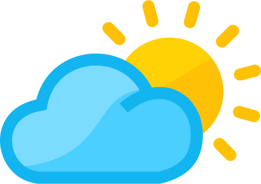
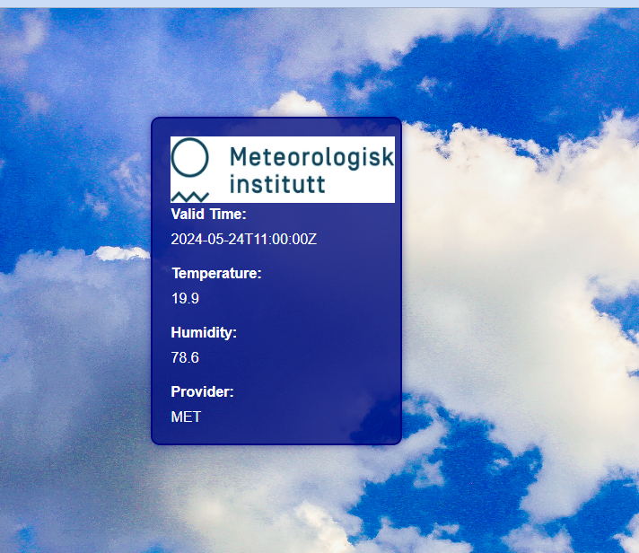

<!-- Improved compatibility of back to top link: See: https://github.com/othneildrew/Best-README-Template/pull/73 -->

<!--
*** Thanks for checking out the Best-README-Template. If you have a suggestion
*** that would make this better, please fork the repo and create a pull request
*** or simply open an issue with the tag "enhancement".
*** Don't forget to give the project a star!
*** Thanks again! Now go create something AMAZING! :D
-->

<!-- PROJECT SHIELDS -->
<!--
*** I'm using markdown "reference style" links for readability.
*** Reference links are enclosed in brackets [ ] instead of parentheses ( ).
*** See the bottom of this document for the declaration of the reference variables
*** for contributors-url, forks-url, etc. This is an optional, concise syntax you may use.
*** https://www.markdownguide.org/basic-syntax/#reference-style-links
-->

<!-- PROJECT LOGO -->
 

    
  </a>

  <h3 align="center">Multi-API Weather Forecast</h3>

<!-- ABOUT THE PROJECT -->
## About The Project

This Java project is a comprehensive refactoring exercise focused on the Bulls & Cows guessing game. The primary objective of this exercise is to enhance the code's structure, testability, and maintainability by applying key software engineering principles and best practices.

Project Overview
This Spring Boot application is designed to integrate multiple weather APIs, providing users with comprehensive and up-to-date weather forecasts. The application leverages the strengths of various weather services to ensure the delivery of accurate and current weather data. As part of a school exam project, this application primarily focuses on providing weather data for a specific city in Sweden.

    
  </a>

The main goals of this refactoring exercise are:

* This Spring Boot application is designed to integrate multiple weather APIs, providing users with comprehensive and up-to-date weather forecasts. 
* The application leverages the strengths of various weather services to ensure the delivery of accurate and current weather data. 
* As part of a school exam project, this application primarily focuses on providing weather data for a specific city in Sweden.

(<a href="#readme-top">back to top</a>)

<!-- TECHNOLOGIES USED -->
## Technologies used
* [![Java][Java.com]][Java-url]
* [![Spring Boot][SpringBoot.com]][SpringBoot-url]
* [![HTML][HTML.com]][HTML-url]
* [![Thymeleaf][Thymeleaf.com]][Thymeleaf-url]
* [![JSON][JSON.com]][JSON-url]
* [![Maven][Maven.com]][Maven-url]
* [![REST API][RestAPI.com]][RestAPI-url]

(<a href="#readme-top">back to top</a>)

<!-- GETTING STARTED -->
## Getting Started

To run this project, you need the following software installed:

* Java Development Kit (JDK) 11 or higher
* Maven for managing dependencies and building the project

## Installation
* Clone the repository
* Build the project using Maven
* Run the tests to ensure everything is set up correctly
* To start the game, run the following command: java -jar target/weather-api-1.0-SNAPSHOT.jar

(<a href="#readme-top">back to top</a>)

<!-- LICENSE -->
## License
Distributed under the MIT License.

(<a href="#readme-top">back to top</a>)

<!-- CONTACT -->
## Contact
Kerem Bjälvenäs Tazedal - kerem.tazedal.89@gmail.com

Project Link: [https://github.com/Kerem1989/spring-boot-weather-api](https://github.com/Kerem1989/spring-boot-weather-api)

<!-- ACKNOWLEDGEMENTS -->
## Acknowledgements

Special thanks to Dmitry Khalizov for his valuable contributions and collaboration throughout the development of this project.

(<a href="#readme-top">back to top</a>)

<!-- MARKDOWN LINKS & IMAGES -->
<!-- https://www.markdownguide.org/basic-syntax/#reference-style-links -->
[contributors-shield]: https://img.shields.io/github/contributors/othneildrew/Best-README-Template.svg?style=for-the-badge
[contributors-url]: https://github.com/othneildrew/Best-README-Template/graphs/contributors
[forks-shield]: https://img.shields.io/github/forks/othneildrew/Best-README-Template.svg?style=for-the-badge
[forks-url]: https://github.com/othneildrew/Best-README-Template/network/members
[stars-shield]: https://img.shields.io/github/stars/othneildrew/Best-README-Template.svg?style=for-the-badge
[stars-url]: https://github.com/othneildrew/Best-README-Template/stargazers
[issues-shield]: https://img.shields.io/github/issues/othneildrew/Best-README-Template.svg?style=for-the-badge
[issues-url]: https://github.com/othneildrew/Best-README-Template/issues
[license-shield]: https://img.shields.io/github/license/othneildrew/Best-README-Template.svg?style=for-the-badge
[license-url]: https://github.com/othneildrew/Best-README-Template/blob/master/LICENSE.txt
[linkedin-shield]: https://img.shields.io/badge/-LinkedIn-black.svg?style=for-the-badge&logo=linkedin&colorB=555
[linkedin-url]: https://linkedin.com/in/othneildrew
[product-screenshot]: images/screenshot.png
[Next.js]: https://img.shields.io/badge/next.js-000000?style=for-the-badge&logo=nextdotjs&logoColor=white
[Next-url]: https://nextjs.org/
[Java.com]: https://img.shields.io/badge/Java-007396?style=for-the-badge&logo=java&logoColor=white
[Java-url]: https://www.java.com
[MySQL.com]: https://img.shields.io/badge/MySQL-4479A1?style=for-the-badge&logo=mysql&logoColor=white
[MySQL-url]: https://www.mysql.com
[JSON.com]: https://img.shields.io/badge/JSON-000000?style=for-the-badge&logo=json&logoColor=white
[JSON-url]: https://www.json.org
[Maven.com]: https://img.shields.io/badge/Maven-C71A36?style=for-the-badge&logo=apache-maven&logoColor=white
[Maven-url]: https://maven.apache.org
[SpringBoot.com]: https://img.shields.io/badge/Spring_Boot-6DB33F?style=for-the-badge&logo=spring-boot&logoColor=white
[SpringBoot-url]: https://spring.io/projects/spring-boot
[RestAPI.com]: https://img.shields.io/badge/REST_API-FF5733?style=for-the-badge&logo=rest&logoColor=white
[RestAPI-url]: https://restfulapi.net
[Thymeleaf.com]: https://img.shields.io/badge/Thymeleaf-005F0F?style=for-the-badge&logo=thymeleaf&logoColor=white
[Thymeleaf-url]: https://www.thymeleaf.org
[HTML.com]: https://img.shields.io/badge/HTML-E34F26?style=for-the-badge&logo=html5&logoColor=white
[HTML-url]: https://developer.mozilla.org/en-US/docs/Web/HTML

